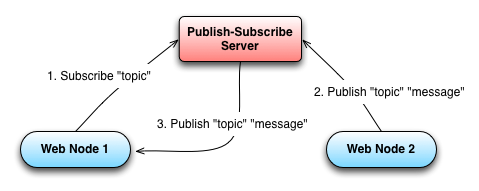
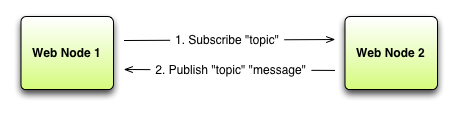

# DubSub - Distributed PubSub with Akka Cluster

### Background

PubSub, or [Publish-Subscribe](http://en.wikipedia.org/wiki/Publish%E2%80%93subscribe_pattern) is a messaging pattern where the senders of messages (Publishers) have no knowledge of the receivers (Subscribers) and messages are instead categorised into 'topics' or 'channels', rather than being sent directly to specific receivers.

This loose-coupling provides for greater scalability and also provides a nice paradigm with which to design distributed systems.

### Single point of bottleneck (SPOB) and more hops than a brewery

Typical implementations of the PubSub pattern denote a separate layer of network architecture, or just one server perhaps, to run as a PubSub server.

When reasoned about in a web server environment, this approach fails to make sense in terms of both performance and scalability.

Consider the following example:



Publishing a message takes two network hops to get from the second node to the first node and because all messages are routed via the Publish-Subscribe server, this can become a bottleneck.

## DubSub

DubSub is designed to move the Publish-Subscribe server onto the same process, or hardware as the web server and distribute the subscriptions around a cluster of nodes automatically, using [Akka Cluster](http://doc.akka.io/docs/akka/2.1.2/cluster/cluster.html#intro).

It provides a simple Publish-Subscribe interface to work with, as a dedicated service will, yet it will route messages in a peer-to-peer fashion.

This means that you can effectively cut out the middle man and so in comparison to the typical example above, a DubSub enabled cluster (of just two nodes) will look like the following:




## How to use DubSub

There is a [Play plugin](https://github.com/alexanderjarvis/Play-DubSub) available, which makes it very easy to get started if you are using this web framework.

#####Otherwise you can integrate DubSub into any Scala application:

Add DubSub to your project in Build.scala

```scala
libraryDependencies += "uk.co.panaxiom" % "dubsub" % "0.2-SNAPSHOT"

resolvers += Resolver.url("Alex's GitHub Repository", url("http://alexanderjarvis.github.com/snapshots/"))(Resolver.ivyStylePatterns)
```

On application startup, create the DubSub ActorSystem and create a DubSub actor.

```scala
val system = ActorSystem("DubSubSystem", config.getConfig("dubsub"))
system.actorOf(Props[DubSub], "DubSub")
```

Set the remote port of at least your first seed node as a runtime property (or in application.conf configuration)

	-Ddubsub.akka.remote.netty.port=2551

Send Publish, Subscribe and Unsubscribe messages from *any* node in your cluster and watch DubSub work seamlessly.

```scala
val dubsub = system.actorFor("/user/DubSub")

dubsub ! Subscribe("topic")
dubsub ! Publish("topic", "message")
dubsub ! Unsubscribe("topic")
```

When subscribing to DubSub, the actor which you send the Subscribe message from is the actor that will receive any Publish message that is sent through the cluster with the same topic.

To get started on writing Akka actors, please read through the documentation at [akka.io](http://akka.io/)

##### Optional

You can specify the seed-nodes of the cluster in your application.conf:

```
dubsub {
  akka {
    cluster {
      seed-nodes = [
        "akka.tcp://DubSubSystem@127.0.0.1:2551",
        "akka.tcp://DubSubSystem@127.0.0.1:2552"]
    }
  }
}
```

## How to run the tests

DubSub uses the sbt-multi-jvm plugin to perform tests across multiple JVMs and so requires a special command to run the tests:

```
$ sbt
> multi-jvm:test
```
